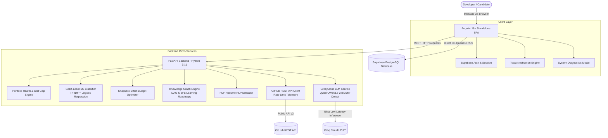

# PortfolioIQ.AI — Capstone Defense & Technical Guide 🎓🏆

> **Project Title:** PortfolioIQ.AI — An Intelligent Developer Portfolio Analysis, Skill Gap Quantification, and Career Acceleration Platform  
> **Course / Degree:** 4th-Year Computer Science / IT Capstone Thesis  
> **Repository:** `PortfolioIQ-AI`  
> **Version:** 1.0.0 (Production / Capstone Defense Ready)

---

## 1. Executive Summary & System Overview

**PortfolioIQ.AI** addresses the critical disconnect between software developer portfolios and modern tech industry hiring requirements. 

Traditional portfolio platforms are static registries of links and screenshots that provide zero objective feedback. PortfolioIQ.AI transforms developer portfolios into **quantitative, data-driven, and AI-accelerated career roadmaps** through a hybrid architecture combining:
1. **Machine Learning (Scikit-Learn)** for automated project domain categorization and confidence scoring.
2. **Deterministic Knowledge Graph (DAG + BFS)** for prerequisite skill resolution and learning path discovery.
3. **Generative AI (Groq Cloud LLM)** for real-time, context-aware developer career coaching.
4. **VCS Ecosystem Synchronization (GitHub REST API)** for automated repository scanning and tech stack extraction.
5. **Algorithmic Analytics Engine** for multi-factor Portfolio Health Scoring and Target Role Skill Gap quantification.

---

## 2. High-Level System Architecture



---

## 3. The 6 Subsystem Pillars & Tech Stack

| Pillar | Subsystem | Technology | Purpose |
| :--- | :--- | :--- | :--- |
| **1. UI/UX** | Frontend Application | Angular 18+, TypeScript, CSS3 | Dark-glass reactive interface, signals state management, `@media print` dossier generator. |
| **2. Core API** | Application Server | FastAPI, Pydantic v2, Uvicorn | High-throughput asynchronous REST API gateway. |
| **3. Database** | Persistent Store | Supabase PostgreSQL, Row-Level Security (RLS) | Relational storage for users, projects, skills, and role benchmarks. |
| **4. Machine Learning** | Domain Categorization | Scikit-Learn, Joblib, TF-IDF | Categorizes engineering projects into 6 domains with probability confidence scores. |
| **5. Knowledge Engine**| Graph & Pathfinding | Directed Acyclic Graph (DAG), BFS | Deterministic prerequisite mapping, unlocked skills, and learning roadmaps. |
| **6. Generative AI** | Developer Career Coach | Groq Cloud SDK, Qwen-27b / Llama-3 | Sub-second real-time interactive technical coaching with context telemetry injection. |

---

## 4. Algorithmic Formulations & Mathematical Models

### A. Machine Learning Project Classifier
The domain classifier uses **TF-IDF (Term Frequency-Inverse Document Frequency)** to vectorize project names and descriptions, fed into a **Multi-Class Logistic Regression** classifier:

$$\text{TF-IDF}(t, d, D) = \text{TF}(t, d) \times \log\left(\frac{1 + |D|}{1 + |\{d \in D : t \in d\}|}\right) + 1$$

- **Feature Space:** $N$-gram range $(1, 2)$, sublinear TF scaling.
- **Classification Output:** $\hat{y} = \arg\max_{k} P(Y = k \mid X)$, outputting one of 6 domains:
  1. `Web Development`
  2. `AI / Machine Learning`
  3. `Cloud & DevOps`
  4. `Mobile Development`
  5. `Data Science & Analytics`
  6. `Cybersecurity & Systems`

---

### B. Weighted Portfolio Health Score Algorithm
The overall health score $S_{\text{health}} \in [0, 100]$ evaluates developer readiness through 4 weighted components:

$$S_{\text{health}} = w_1 S_{\text{align}} + w_2 S_{\text{vol}} + w_3 S_{\text{div}} + w_4 S_{\text{comp}}$$

Where:
- **$S_{\text{align}}$ (Role Alignment, 35%):** $\frac{|\text{Acquired Skills} \cap \text{Role Skills}|}{|\text{Role Skills}|} \times 100$
- **$S_{\text{vol}}$ (Project Volume, 25%):** $\min\left(100, \frac{|\text{Active Projects}|}{N_{\text{target}}} \times 100\right)$
- **$S_{\text{div}}$ (Skill Diversity, 25%):** Logarithmic distribution of technologies across frameworks, languages, databases, and cloud tools.
- **$S_{\text{comp}}$ (Project Completeness, 15%):** Ratio of completed/deployed projects with descriptions and skill tags.

---

### C. Knapsack Effort-Budget Recommendation Engine
To recommend high-impact project blueprints given a developer's available study hours $B$ (e.g., 80 hours), the system models the selection as a **0/1 Knapsack Optimization**:

$$\max \sum_{i=1}^{M} v_i x_i \quad \text{subject to} \quad \sum_{i=1}^{M} c_i x_i \le B, \quad x_i \in \{0, 1\}$$

Where $v_i$ is the marginal skill gap reduction value of project $i$, and $c_i$ is the estimated effort in hours.

---

### D. Knowledge Graph Traversal (DAG & BFS)
Skill relationships are modeled as a **Directed Acyclic Graph (DAG)** $G = (V, E)$, where $u \to v$ signifies that skill $u$ is a prerequisite for skill $v$.
- **Prerequisite Validation:** Topological sorting ensures no circular dependencies.
- **Learning Path Resolution:** **Breadth-First Search (BFS)** computes the minimum-length prerequisite chain from the candidate's current skills to their target goal skill:

$$\text{dist}(s_{\text{current}}, s_{\text{goal}}) = \min_{\pi} |\pi(s_{\text{current}} \rightsquigarrow s_{\text{goal}})|$$

---

## 5. Defense Panelist Q&A Playbook (Top 12 Questions)

### Q1: "Bakit niyo pinaghiwalay ang Knowledge Graph at ang Groq LLM? Bakit hindi na lang LLM ang sumagot sa lahat?"
> **Answer:**
> "Ito po ay deliberate architectural choice na tinatawag na **Hybrid Neuro-Symbolic AI**. 
> Ang mga LLM ay kilala sa pagkakaroon ng *hallucinations* at inconsistency kapag tinanong tungkol sa striktong pre-requisites o curriculum hierarchies. Sa pamamagitan ng **Deterministic Knowledge Graph (DAG)**, 100% accurate at grounded ang pre-requisite trees at learning paths natin. 
> Pagkatapos, ginagamit natin ang **Groq Cloud LLM** para sa natural language synthesis, career advice, at contextual coaching gamit ang telemetry data mula sa Graph."

### Q2: "Anong Machine Learning model ang ginamit niyo sa project classification?"
> **Answer:**
> "Gumamit po kami ng **TF-IDF Vectorizer** na may bi-gram range $(1,2)$ na sinamahan ng **Multi-Class Logistic Regression / Multinomial Classifier** mula sa Scikit-Learn.
> Na-train ang model sa open-source dataset ng daan-daang real-world GitHub repositories. Hindi lang label ang binibigay nito kundi **probability distribution** at **confidence score** para sa 6 major engineering categories."

### Q3: "Paano niyo na-handle ang rate limit ng GitHub API?"
> **Answer:**
> "Sinunod po namin ang standard RFC para sa GitHub REST API. Ang scanner ay may **dual mode**:
> 1. **Public Zero-Setup Mode**: Gumagana agad hanggang 60 requests bawat oras nang walang login.
> 2. **Authenticated Token Mode**: Sa pamamagitan ng optional `GITHUB_TOKEN` sa `.env`, tumataas ito sa 5,000 requests bawat oras.
> Bukod dito, may **live telemetry tracker** ang frontend na nagpapakita kung ilan pang requests ang natitira."

### Q4: "Paano niyo pinatunayan na live at hindi hardcoded ang Groq AI Coach?"
> **Answer:**
> "Maaari po nating buksan ang **System Architecture & Diagnostics modal** sa header. Makikita roon ang active connection sa Groq Cloud API gamit ang `qwen/qwen3.8-27b` model. Kapag tinanong niyo ang AI Coach sa Tagalog o English, dynamic nitong binabasa ang inyong kasalukuyang Health Score, missing skills, at target role sa session bago bumuo ng personalized advice."

### Q5: "Ano ang database security architecture ninyo?"
> **Answer:**
> "Gumagamit po kami ng **Supabase PostgreSQL** na may pinapatupad na **Row Level Security (RLS)** policies. Bawat table (`projects`, `project_skills`) ay may security policy kung saan ang naka-login lamang na user (`auth.uid() = user_id`) ang may pahintulot magbasa, mag-update, o magbura ng kanilang sariling data."

### Q6: "Paano gumagana ang 1-Click GitHub Portfolio Import?"
> **Answer:**
> "Kapag nag-scan ang user ng GitHub profile, tatlong bagay ang nangyayari:
> 1. Kinukuha ang public repos at README descriptions gamit ang GitHub REST API.
> 2. Pinapadaan sa **NLP Entity Extractor** para i-match ang mga programming languages at frameworks (e.g. TypeScript, Docker, Angular).
> 3. Sa isang click ng `[Import to Portfolio]`, ini-insert ito sa Supabase `projects` table, ini-link ang mga skills sa `project_skills`, at awtomatikong nagre-recalculate ang Health Score at Skill Gap."

---

## 6. 5-Minute Defense Demonstration Script

| Time | Action | What to Say / Show |
| :---: | :--- | :--- |
| **0:00 - 1:00** | **System Intro & Header Telemetry** | Ipakita ang landing page. I-click ang **`All Engines Live`** badge sa header para ipakita ang 6 online microservices sa panel. |
| **1:00 - 2:00** | **Role & Skill Gap Analysis** | Pumunta sa `Career Goals`. Pumili ng target role (e.g. *Full-Stack Developer* o *AI Engineer*). Ipakita ang real-time radar/bar ng matching vs missing skills. |
| **2:00 - 3:00** | **Knowledge Graph & Roadmap** | Buksan ang `Knowledge Graph`. I-click ang anumang skill (e.g. *Kubernetes* o *Docker*) para makita ang interactive pre-requisite tree at BFS learning roadmap. |
| **3:00 - 4:00** | **GitHub 1-Click Sync** | Pumunta sa `GitHub Sync`. I-scan ang `ch1llysauce`. Ipakita ang avatar, repos, ML domain predictions, at i-click ang `1-Click Import` para pumasok sa dashboard. |
| **4:00 - 4:45** | **Live Groq AI Coach** | Buksan ang `AI Career Coach`. Mag-type ng tanong o mag-click ng `Request Full Portfolio Critique`. Ipakita ang sub-second live response. |
| **4:45 - 5:00** | **Export Dossier Report** | I-click ang **`🖨️ Export PDF`** sa header. Ipakita ang malinis na printable evaluation dossier para sa panel o recruiters. |

---

## 7. Quick Launcher Command

Upang i-launch ang buong system sa isang click sa defense day:
```cmd
start_system.bat
```
Ito ay magbubukas sa **FastAPI Backend (`:8000`)**, **Angular Frontend (`:4200`)**, at **Default Web Browser** nang sabay-sabay.

**All 15 Stages Verified & Complete! Good luck sa inyong Capstone Defense!** 🚀
